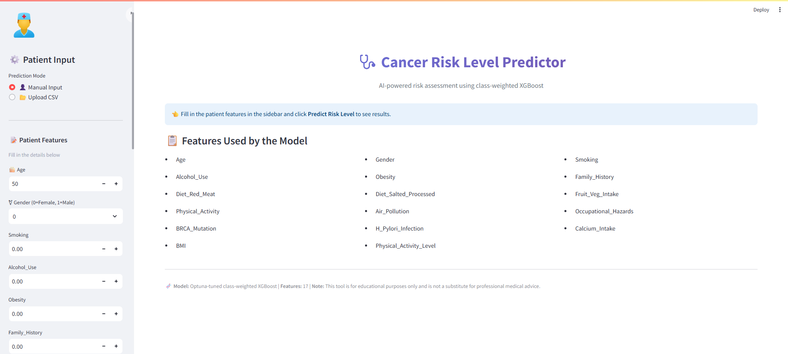
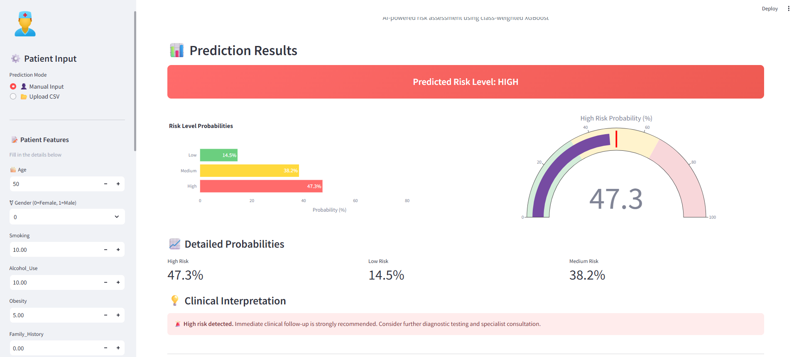
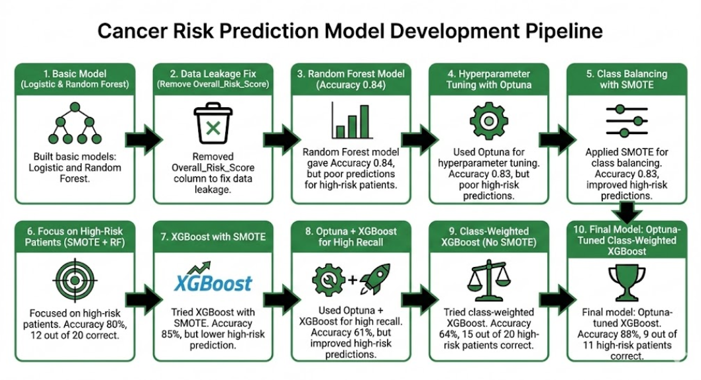
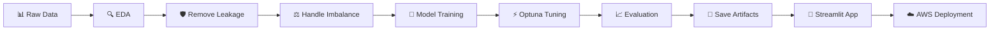

<div align="center">

# 🩺 Cancer Risk Prediction using Machine Learning

### *Predicting cancer risk levels with AI — from raw data to deployed web application*

[](https://www.python.org/)
[](https://streamlit.io/)
[](https://xgboost.readthedocs.io/)
[](https://scikit-learn.org/)
[](https://optuna.org/)
[](https://imbalanced-learn.org/)
[](https://aws.amazon.com/)
[](LICENSE)

**🎯 88% Accuracy  |  🎚️ 0.72 Macro F1  |  📊 17 Features  |  ⚡ Real-time Predictions**

</div>

---

A complete end-to-end machine learning project that classifies patients into **Low**, **Medium**, or **High** cancer risk categories based on lifestyle, demographic, and clinical features. The system includes rigorous data analysis, leakage prevention, class imbalance handling, hyperparameter tuning with Optuna, and an interactive Streamlit web application ready for cloud deployment.

---

## 🖥️ App Preview

> A glimpse of the interactive Streamlit web app that brings the predictions to life:

<div align="center">



*Clean sidebar input form with 17 patient features and intuitive controls*



*Color-coded risk results with interactive Plotly visualizations and clinical interpretation*

</div>

---

## 📋 Table of Contents
- [❓ Problem Statement](#-problem-statement)
- [🎯 Approach](#-approach)
- [✅ Solution](#-solution)
- [📊 Dataset](#-dataset)
- [🔄 Project Workflow](#-project-workflow)
- [💡 Key Findings](#-key-findings)
- [📈 Model Performance](#-model-performance)
- [🛠 Tech Stack](#-tech-stack)
- [📁 Project Structure](#-project-structure)
- [⚙️ Installation & Setup](#️-installation--setup)
- [🚀 Running the App Locally](#-running-the-app-locally)
- [☁️ Deployment on AWS EC2](#️-deployment-on-aws-ec2)
- [🔮 Future Improvements](#-future-improvements)

---

## ❓ Problem Statement

> **Cancer is one of the leading causes of death globally — and early detection saves lives.**

Identifying patients at high risk of developing cancer remains a critical yet challenging task for healthcare systems. This project addresses four key challenges:

| 🚧 Challenge | 💬 Why It Matters |
|----|----|
| **Multiple Risk Factors** | Cancer risk depends on a complex mix of lifestyle, genetic, environmental, and demographic factors — manual assessment is inconsistent and error-prone |
| **Severe Class Imbalance** | High-risk patients are only ~5% of the dataset — traditional models tend to ignore them in favor of overall accuracy |
| **Asymmetric Cost of Errors** | Missing a high-risk patient (false negative) has far worse consequences than a false alarm — but standard accuracy doesn't capture this |
| **Lack of Accessible Tools** | Predictive models are usually trapped in research papers, not delivered as usable applications |

### 🎯 The Mission

> Build a machine learning system that accurately classifies patients into **Low / Medium / High** risk categories — with **special emphasis on identifying High-risk patients** — and deliver it as an accessible, production-ready web application.

---

## 🎯 Approach

A structured, end-to-end ML pipeline designed to address each aspect of the problem:

### 🔍 1. Understanding the Data
Conducted thorough **Exploratory Data Analysis (EDA)** to uncover feature distributions, correlations, and the severity of class imbalance. Identified key lifestyle and environmental factors most strongly correlated with risk.

### 🛡️ 2. Preventing Data Leakage
Audited features rigorously and **removed two leaky variables**:
- ❌ `Cancer_Type` — an outcome variable, not a true predictor
- ❌ `Overall_Risk_Score` — a precomputed score that essentially encodes the answer

> 💡 *Without this step, the model would have achieved misleadingly perfect scores by cheating.*

### ⚖️ 3. Handling Class Imbalance
Tested two strategies:
- ✅ **SMOTE** — generates synthetic high-risk samples to balance the dataset
- ✅ **Class Weighting** — penalizes errors on rare classes during training

Applied **only on training data** to prevent test-set contamination.

### 🧪 4. Model Experimentation
Tested multiple algorithms in a controlled, comparable way:
- Logistic Regression *(baseline)*
- Random Forest Classifier
- Random Forest + SMOTE
- XGBoost *(baseline)*
- **Class-weighted XGBoost** *(winner)*

Used **stratified 80/20 train/test split** to preserve class proportions.

### ⚡ 5. Hyperparameter Optimization with Optuna
Employed **Optuna** with the TPE sampler for intelligent, efficient hyperparameter tuning:
- Optimized for **macro F1-score** and **High-class recall**
- Ran **40+ trials** with cross-validation
- Used **ImbPipeline** to integrate resampling inside CV folds — preventing leakage during tuning

### 📊 6. Evaluation Strategy
Chose metrics suited to **imbalanced classification**:
- **Macro F1-Score** — treats all classes equally
- **Per-class Precision & Recall** — exposes weaknesses on minority classes
- **Confusion Matrix** — detailed error analysis

> ⚠️ *Did NOT rely on raw accuracy alone — it would have been misleading.*

### 🚀 7. Deployment
Built an interactive **Streamlit web app** with:
- 👤 Single-patient input mode
- 📂 Batch CSV processing mode
- 📊 Plotly visualizations (gauges, probability bars, pie charts)
- 🎨 Color-coded clinical recommendations
- ☁️ AWS EC2 deployment guide + Docker support for portability

---

## 🏗️ System Architecture





---

## ✅ Solution

A complete machine learning system consisting of three key components:

### 🤖 1. The Predictive Model

An **Optuna-tuned, class-weighted XGBoost classifier** trained on 17 carefully selected features:

<div align="center">

| 📏 Metric | 🎯 Result |
|--------|--------|
| **Overall Accuracy** | **88%** |
| **Macro F1-Score** | **0.72** |
| **High-Risk Recall** | **0.45** *(↑ from 0.05 baseline)* |
| **Low-Risk Recall** | **0.78** |
| **Medium-Risk Recall** | **0.92** |

</div>

> 🚀 The model **9x'd the recall on the critical High-risk class** compared to a naive baseline, while maintaining strong overall accuracy.

### 💻 2. The Interactive Web Application

A polished **Streamlit app** featuring:
- 📝 **Single Patient Mode** — enter 17 features in a clean sidebar form
- 📂 **Batch Mode** — upload a CSV file for bulk predictions
- 📊 **Visual Outputs** — gauge charts, probability distributions, color-coded risk levels
- 💡 **Clinical Interpretation** — appropriate follow-up recommendations per risk level
- ⬇️ **CSV Export** — download batch results for further analysis

### ☁️ 3. The Deployment Pipeline

Production-ready with:
- 📦 **`requirements.txt`** — reproducible Python environments
- 🐳 **`Dockerfile`** — containerized deployment
- 📖 **Complete AWS EC2 deployment guide** — three approaches for 24/7 uptime (`nohup`, `tmux`, `systemd`)
- 🔄 **Alternative deployment paths** — Streamlit Cloud, AWS Elastic Beanstalk

### 🏆 Key Achievements

- ✅ **Eliminated data leakage** that would have inflated metrics artificially
- ✅ **Boosted minority class recall by 9x** through smart class balancing
- ✅ **Built a production-ready app** with proper artifact versioning
- ✅ **Documented end-to-end** for full reproducibility and deployment

---

## 📊 Dataset

The dataset contains patient records with **17 features** spanning multiple risk factor categories:

<div align="center">

| 📌 Category | 🔬 Features |
|----------|----------|
| **Demographics** | Age, Gender |
| **Lifestyle** | Smoking, Alcohol_Use, Obesity, Physical_Activity, Physical_Activity_Level |
| **Diet** | Diet_Red_Meat, Diet_Salted_Processed, Fruit_Veg_Intake, Calcium_Intake |
| **Medical History** | Family_History, BRCA_Mutation, H_Pylori_Infection, BMI |
| **Environmental** | Air_Pollution, Occupational_Hazards |

</div>

### 📉 Class Distribution (Highly Imbalanced)

| Risk Level | Count | Percentage |
|-----------|-------|-----------|
| 🟢 **Low** | 324 | ~16% |
| 🟡 **Medium** | 1,574 | ~79% |
| 🔴 **High** | 102 | ~5% |

> *This severe imbalance — only 5% High-risk — drove the need for SMOTE and class weighting.*

---

## 🔄 Project Workflow



### Step-by-Step Pipeline

1. **🔍 EDA** — Distribution analysis, correlation heatmaps, countplots, KDE plots
2. **🧹 Preprocessing** — LabelEncoder for target, one-hot encoding for categoricals, leak removal
3. **⚖️ Class Imbalance** — SMOTE and class weighting (applied to training data only)
4. **🧪 Model Comparison** — 6 different model configurations tested
5. **⚡ Hyperparameter Tuning** — Optuna with TPE sampler, 40+ trials
6. **🚀 Deployment** — Streamlit web app with Plotly visuals

---

## 💡 Key Findings

EDA and feature correlation analysis revealed the strongest predictors of High risk:

- 🚬 **Heavy smoking** — the single strongest predictor of High risk
- 🍷 **High alcohol consumption** — strongly correlates with High risk
- 🥩 **High red meat intake** — associated with elevated risk
- 🧂 **Salted/processed food consumption** — strongly linked to High risk
- 🏭 **Air pollution exposure** — a major differentiator
- ⚠️ **Hazardous occupational exposures** — push risk significantly higher
- ⚖️ **Higher obesity levels** — correlate with higher risk

---

## 📈 Model Performance

**Final Model:** Optuna-tuned class-weighted XGBoost

<div align="center">

| Metric    | 🔴 High | 🟢 Low  | 🟡 Medium | 📊 Macro Avg |
|-----------|------|------|--------|-----------|
| **Precision** | 0.50 | 0.76 | 0.92   | 0.73      |
| **Recall**    | 0.45 | 0.78 | 0.92   | 0.72      |
| **F1-Score**  | 0.47 | 0.77 | 0.92   | 0.72      |

### 🎯 Overall Accuracy: **88%**

</div>

The model strikes an excellent balance between overall accuracy and strong recall on the clinically most important High-risk class.

---

## 🛠 Tech Stack

<div align="center">

| Category | Technologies |
|----------|--------------|
| **🐍 Language** | Python 3.11 |
| **🤖 ML Libraries** | scikit-learn, XGBoost, imbalanced-learn |
| **⚡ Tuning** | Optuna |
| **📊 Data Processing** | Pandas, NumPy |
| **📈 Visualization** | Matplotlib, Seaborn, Plotly |
| **🌐 Web App** | Streamlit |
| **💾 Model Persistence** | joblib |
| **☁️ Deployment** | AWS EC2, Docker |

</div>

---

## 📁 Project Structure

```
Cancer_Risk_Prediction/
│
├── 📓 cancer_risk_predictor.ipynb     # Full ML pipeline notebook
├── 🌐 app.py                          # Streamlit web application
│
├── 🤖 model_xgb_new.pkl               # Trained XGBoost model
├── 🏷️ label_encoder.pkl               # Fitted LabelEncoder
├── 📝 feature_names.pkl               # 17 feature names
│
├── 📦 requirements.txt                # Python dependencies
├── 🐳 Dockerfile                      # Container deployment config
├── 🚫 .gitignore                      # Files to exclude from Git
└── 📖 README.md                       # This file
```

---

## ⚙️ Installation & Setup

### 📋 Prerequisites
- Python 3.9 or higher
- pip

### 🚀 Quick Start

**1️⃣ Clone the repository**
```bash
git clone https://github.com/Aryan09092001/Predictive_Modeling_for_Cancer_Risk_Assessment_Using_ML.git
cd Predictive_Modeling_for_Cancer_Risk_Assessment_Using_ML
```

**2️⃣ Create a virtual environment** *(recommended)*
```bash
python -m venv venv

# Windows
venv\Scripts\activate

# macOS/Linux
source venv/bin/activate
```

**3️⃣ Install dependencies**
```bash
pip install -r requirements.txt
```

---

## 🚀 Running the App Locally

Launch the Streamlit app with a single command:

```bash
streamlit run app.py
```

🌐 The app will open in your browser at `http://localhost:8501`

### ✨ App Features

| Feature | Description |
|---------|-------------|
| 👤 **Manual Input** | Interactive sidebar form for individual patient predictions |
| 📂 **Batch Mode** | Upload CSV files for bulk predictions |
| 📊 **Visual Outputs** | Probability bars, gauge charts, pie charts |
| 💡 **Clinical Interpretation** | Color-coded results with follow-up recommendations |
| ⬇️ **CSV Export** | Download batch predictions for further analysis |

---

## ☁️ Deployment on AWS EC2

Deploy the app to AWS EC2 with these step-by-step commands.

### 🔹 Step 1: Launch an EC2 Instance

1. Sign in to the [AWS Management Console](https://aws.amazon.com/console/)
2. Navigate to **EC2 → Instances → Launch Instance**
3. Configure:
   - **Name:** `cancer-risk-predictor`
   - **AMI:** Ubuntu Server 22.04 LTS *(Free tier eligible)*
   - **Instance Type:** `t2.micro` *(Free tier)*
   - **Key Pair:** Create a new key pair, download the `.pem` file
   - **Security Group:** Allow **SSH (port 22)** and **Custom TCP (port 8501)** from `0.0.0.0/0`
4. Click **Launch Instance** ✅

### 🔹 Step 2: Connect via SSH

```bash
# Set permissions on the key file (Mac/Linux only)
chmod 400 your-key.pem

# Connect via SSH (replace with your EC2 public IP)
ssh -i "your-key.pem" ubuntu@<your-ec2-public-ip>
```

> 💡 **Windows users:** Use PuTTY or run the command without `chmod`.

### 🔹 Step 3: Update System & Install Python

```bash
# Update package list
sudo apt update && sudo apt upgrade -y

# Install Python 3 and pip
sudo apt install python3-pip python3-venv git -y

# Verify installation
python3 --version
pip3 --version
```

### 🔹 Step 4: Clone the Repository

```bash
git clone https://github.com/Aryan09092001/Predictive_Modeling_for_Cancer_Risk_Assessment_Using_ML.git
cd Predictive_Modeling_for_Cancer_Risk_Assessment_Using_ML
```

### 🔹 Step 5: Set Up Python Environment

```bash
# Create a virtual environment
python3 -m venv venv

# Activate it
source venv/bin/activate

# Install dependencies
pip install -r requirements.txt
```

### 🔹 Step 6: Run the Streamlit App

```bash
streamlit run app.py --server.port=8501 --server.address=0.0.0.0
```

### 🔹 Step 7: Access the App

🌐 Open your browser and visit:

```
http://<your-ec2-public-ip>:8501
```

### 🎉 Your app is now live on AWS!

---

## 🔮 Future Improvements

- [ ] 🔍 Add **SHAP values** to explain individual predictions
- [ ] 📊 Include a **feature importance chart** in the app
- [ ] 🔐 Implement **user authentication** for clinical use
- [ ] 💾 Add a **database backend** (PostgreSQL/MongoDB) to log predictions
- [ ] 🎯 Improve **High-class recall** with cost-sensitive learning and threshold tuning
- [ ] 🔒 Deploy with **HTTPS** using Nginx + Let's Encrypt
- [ ] 🌐 Add a **custom domain** name
- [ ] ⚡ Build a **REST API** version using FastAPI
- [ ] 🧪 Add **A/B testing** between model versions
- [ ] 🔄 Set up **CI/CD pipeline** with GitHub Actions

---

## 📄 License

This project is open source and available under the [MIT License](LICENSE).

---

<div align="center">

### ⭐ If you found this project helpful, please consider giving it a star!

**Built with ❤️ for the ML community**

[](https://github.com/Aryan09092001/Predictive_Modeling_for_Cancer_Risk_Assessment_Using_ML)

</div>
